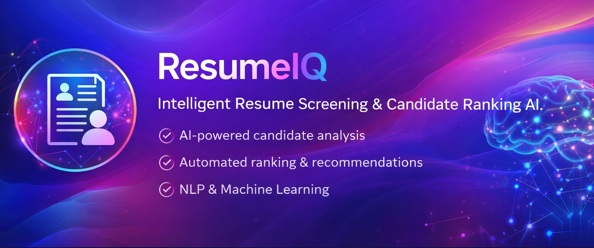
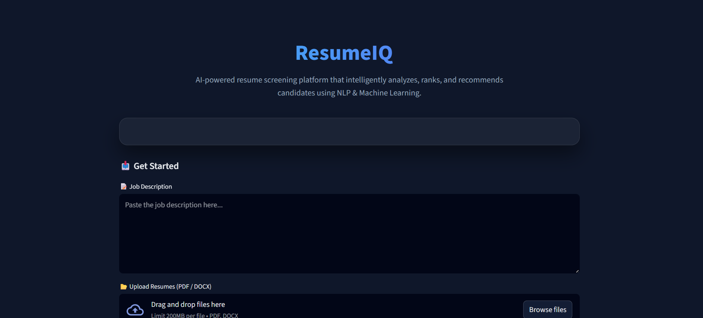
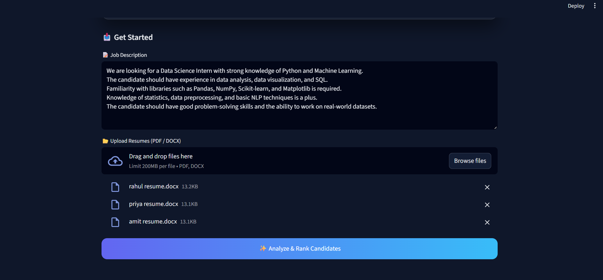
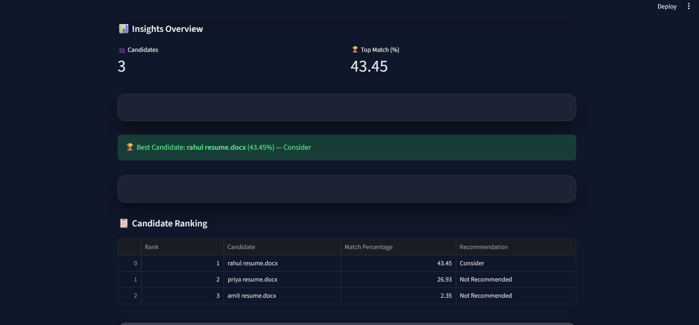

<p align="center">
  
</p>

# ResumeIQ – AI Resume Screening Platform

AI-powered resume screening system that intelligently analyzes, ranks, and recommends candidates using NLP & Machine Learning.

## 🔍 Overview

ResumeIQ is a premium AI-powered resume screening web application designed to help recruiters and hiring teams automate candidate evaluation.

By leveraging Natural Language Processing (NLP) and Machine Learning techniques, ResumeIQ matches resumes against job descriptions and provides ranked recommendations with visual insights.

The platform is optimized for both desktop and mobile devices and follows a modern SaaS-style UI design.

---

## 📸 Product Screenshots

### 🧠 ResumeIQ – AI Resume Screening Interface
<p align="center">
  
</p>

---

### ✍️ Job Description & Resume Upload
<p align="center">
  
</p>

---

### 🏆 Candidate Ranking Dashboard
<p align="center">
  
</p>

---

### 📈 Match Percentage Comparison
<p align="center">
  
</p>

---

## ✨ Key Features

- 📄 Resume parsing with support for PDF & DOCX formats  
- 🧹 Advanced NLP preprocessing (tokenization, stopword removal, text cleaning)  
- 📊 TF-IDF based vectorization for intelligent text representation  
- 🔍 Cosine similarity matching between job descriptions and resumes  
- 🏆 Automated candidate ranking & recommendation system  
- 📈 Interactive visual analytics and dashboards  
- 📱 Fully responsive UI (desktop & mobile friendly)

## 🧠 System Architecture

The application follows a modular and scalable architecture:

- `app.py` – Streamlit UI & application controller  
- `core/` – Core NLP and ML logic  
  - `resume_parser.py` – Resume text extraction  
  - `preprocessing.py` – NLP preprocessing pipeline  
  - `matching.py` – TF-IDF vectorization & similarity scoring  
- `assets/` – UI assets, banner, and screenshots  
- `sample_data/` – Sample resumes for testing  

This separation ensures clean code, reusability, and maintainability.

## 🛠️ Tech Stack

- **Frontend:** Streamlit  
- **Backend:** Python  
- **NLP:** NLTK  
- **Machine Learning:** Scikit-learn  
- **Data Processing:** Pandas, NumPy  
- **Visualization:** Streamlit Charts  

## 🚀 Installation & Setup

### 1️⃣ Clone the repository
```bash
git clone https://github.com/rajlaljipandey/intelligent-resume-screening.git
cd intelligent-resume-screening

## 🔮 Future Enhancements

- Semantic similarity using BERT / SBERT  
- Skill extraction & gap analysis  
- Candidate shortlisting export (CSV / PDF)  
- Recruiter authentication & dashboards  
- ATS integration

## 👨‍💻 Developer

**Raj Lalji Pandey**  
Data Analyst | Machine Learning | NLP  

📧 Email: your_email@example.com  
🔗 GitHub: https://github.com/rajlaljipandey  
🔗 LinkedIn: https://www.linkedin.com/in/raj-lalji-pandey-51288a237/

---

© 2026 ResumeIQ – AI Resume Intelligence Platform  
Built with ❤️ using Python & Streamlit

