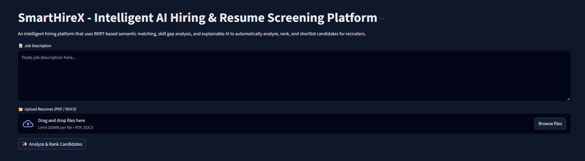
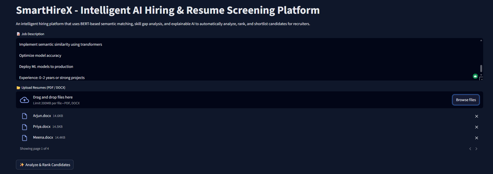
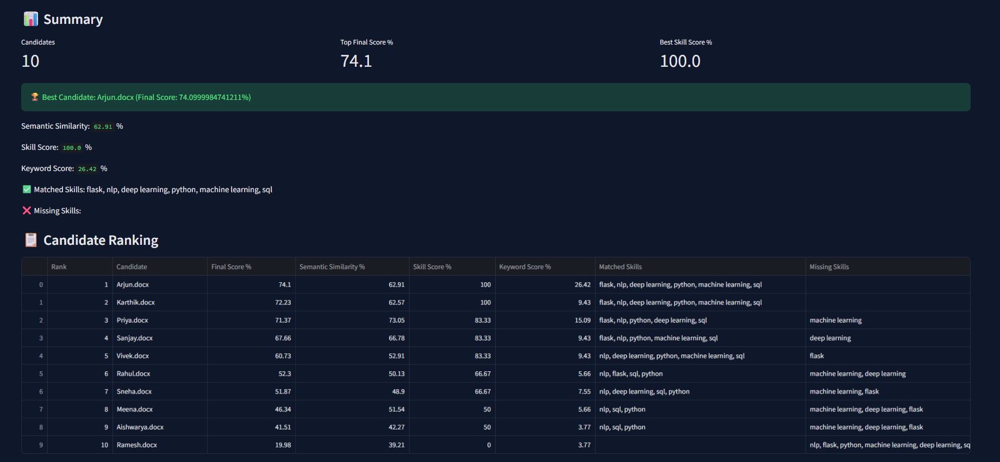
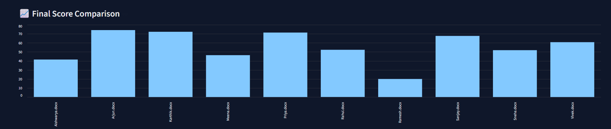

# SmartHireX – Intelligent AI Hiring & Resume Screening Platform

SmartHireX is an AI-powered recruitment platform that automatically analyzes resumes and ranks candidates using Natural Language Processing and Explainable AI techniques.

The system compares candidate resumes with a job description using semantic similarity, skill gap analysis, and keyword coverage to identify the most suitable candidates.

---

## Key Features

### BERT-Based Semantic Matching
Uses transformer-based embeddings to understand contextual meaning between job descriptions and resumes rather than relying only on keywords.

### Resume Parsing
Automatically extracts text from uploaded **PDF and DOCX resumes** for analysis.

### Text Preprocessing
Cleans and prepares extracted resume text for NLP processing.

### Skill Gap Analysis
Identifies:

• Matched skills between resume and job description  
• Missing skills required for the job role

### Keyword Coverage Analysis
Measures how well candidate resumes match important keywords from the job description.

### Explainable AI Scoring
Generates a final candidate score using:

• Semantic Similarity Score  
• Skill Match Score  
• Keyword Coverage Score  

This ensures transparent and interpretable candidate ranking.

### Automatic Candidate Ranking
Ranks candidates based on final score and highlights the best candidate.

### Data Visualization
Displays results using interactive tables and charts.

---

# Application Screenshots

## Home Interface



---

## Upload Job Description & Resumes



---

## Candidate Ranking Results



---

## Final Score Comparison Chart



---

# System Workflow

1. Recruiter enters the job description
2. Multiple resumes are uploaded
3. Resume text is extracted and preprocessed
4. System performs:
   - Skill gap analysis
   - Keyword coverage analysis
   - BERT semantic similarity matching
5. Scores are calculated using explainable AI
6. Candidates are ranked automatically
7. Results are displayed with charts and ranking tables

---

# Technologies Used

Python  
Streamlit  
BERT / Transformers  
Natural Language Processing  
Pandas  

---

# Project Structu

# How to Run the Project

Clone the repository

```
git clone https://github.com/subhashreec1013/SmartHireX.git
```

Go to project folder

```
cd SmartHireX
```

Install dependencies

```
pip install -r requirements.txt
```

Run the application

```
streamlit run app.py
```

Open browser

```
http://localhost:8501
```

---

# Future Improvements

• AI interview question generation  
• Resume recommendation system  
• Recruiter dashboard  
• Integration with job portals  

---

# Author

Subha Shree C
B.Tech CSE w/s Artificial Intelligence & Machine Learning
